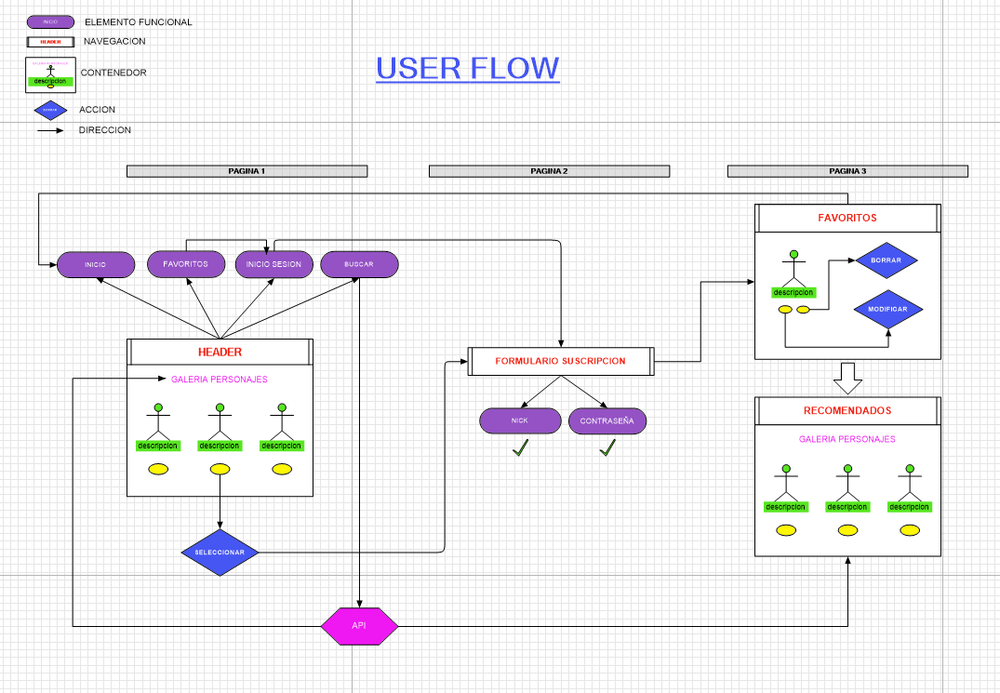

# Superheroes Group Project

This is a group project of a superheroes and villains webpage. This page uses a superheroes API to access the heroes photos, stats and bio.

# Welcome to heroes and villains!

We have developed an innovative application that gives users the possibility to explore fascinating cards with images and character attributes, covering both heroes and villains from various sagas. The app allows users to filter cards based on categories such as humans, Cyborg, aliens, and demons, making it easier to search for characters based on specific preferences. Each card features a button to add the character of choice, redirecting users to an exclusive "Favorites" section. To access this area, a login process is required, ensuring privacy and personalization of the experience. On the "Favorites" page, users can view and manage cards for selected characters, giving them the ability to modify names and attributes, or even add more characters to their custom collection. This interactive and personalized approach offers users a unique and complete experience in exploring and managing their favorite characters.

## FINAL RESULT


## USER FLOW



## SCRUM METHODOLOGY


### What is Scrum?

Scrum is an agile framework that emphasizes collaboration, transparency and iterative product delivery. In our project, Scrum has been the cornerstone of our management, which has allowed us to optimize our development process.

### Teamwork :muscle:

Our project has been based and sustained under the scrum methodology, the organization by different roles and teamwork.

We have all contributed our knowledge to the project, putting ourselves at the total disposal of our colleagues to move the project forward.

## WORK ORGANIZATION

### File names and sass:

Camel Case

### Branch names:

The format we used to create the branch was Camel case for example: 

feature/login-form

feature/favorites-popup

### Units

Images and sections:

% (100%, 50% etc)

## Fonts 

font-family: 'Press Start 2P'
font-family: 'Space Grotesk', serif;

### DEV DEPENDENCIES

- Vue [https://vuejs.org/]
- Scss Reset [https://www.npmjs.com/package/scss-reset]
- Sass [https://sass-lang.com/]

## installation Vue

npm create vue@latest
npm install


## Database link

https://akabab.github.io/superhero-api/api/#alljson

## Folders organization

The project uses the standart Vue template for JS. All static assets are located at public folder. App.vue is the main component. Different pages are represented as views and located at the folder with the name 'views'.

## Naming conventions

Components are named using PascalCase

Other archives are named using kebab-case

SCSS classes and IDs are using kebab-case

Branches are named using the following scheme: feature/page-functionality

## Recommended IDE Setup

[VSCode](https://code.visualstudio.com/) + [Volar](https://marketplace.visualstudio.com/items?itemName=Vue.volar) (and disable Vetur) + [TypeScript Vue Plugin (Volar)](https://marketplace.visualstudio.com/items?itemName=Vue.vscode-typescript-vue-plugin).

## Customize configuration

See [Vite Configuration Reference](https://vitejs.dev/config/).

## Project Setup

```sh
npm install
```

### Compile and Hot-Reload for Development

```sh
npm run dev
```

### Compile and Minify for Production

```sh
npm run build
```

### Run Unit Tests with [Vitest](https://vitest.dev/)

```sh
npm run test:unit
```


## TEAM

- [Veronica Sampedro] (https://github.com/verosampedro)
- [Mark Kil] (https://github.com/MarkWebDeveloper)
- [Daniel Gallo] (https://github.com/DanielGallo84)
- [Brusmel Gil] (https://github.com/BrusmelGil)
- [Isabel Aboli] (https://github.com/IsabelAboliMartinez)


